## Notebook Setup


```python
%load_ext autoreload
%autoreload 2
%matplotlib inline
```


```python
# standard imports
import os
# third party imports
import pandas as pd
import numpy as np
import matplotlib.pyplot as plt
import seaborn as sns
from sklearn import datasets
# local imports (only if we need)
```


```python
#ploting style set to seaborn
sns.set()
```

## Load Data


```python
data = datasets.load_iris()
```


```python
data.keys()
```


    dict_keys(['data', 'target', 'frame', 'target_names', 'DESCR', 'feature_names', 'filename'])


```python
print(data["DESCR"])
```

    .. _iris_dataset:
    
    Iris plants dataset
    --------------------
    
    **Data Set Characteristics:**
    
        :Number of Instances: 150 (50 in each of three classes)
        :Number of Attributes: 4 numeric, predictive attributes and the class
        :Attribute Information:
            - sepal length in cm
            - sepal width in cm
            - petal length in cm
            - petal width in cm
            - class:
                    - Iris-Setosa
                    - Iris-Versicolour
                    - Iris-Virginica
                    
        :Summary Statistics:
    
        ============== ==== ==== ======= ===== ====================
                        Min  Max   Mean    SD   Class Correlation
        ============== ==== ==== ======= ===== ====================
        sepal length:   4.3  7.9   5.84   0.83    0.7826
        sepal width:    2.0  4.4   3.05   0.43   -0.4194
        petal length:   1.0  6.9   3.76   1.76    0.9490  (high!)
        petal width:    0.1  2.5   1.20   0.76    0.9565  (high!)
        ============== ==== ==== ======= ===== ====================
    
        :Missing Attribute Values: None
        :Class Distribution: 33.3% for each of 3 classes.
        :Creator: R.A. Fisher
        :Donor: Michael Marshall (MARSHALL%PLU@io.arc.nasa.gov)
        :Date: July, 1988
    
    The famous Iris database, first used by Sir R.A. Fisher. The dataset is taken
    from Fisher's paper. Note that it's the same as in R, but not as in the UCI
    Machine Learning Repository, which has two wrong data points.
    
    This is perhaps the best known database to be found in the
    pattern recognition literature.  Fisher's paper is a classic in the field and
    is referenced frequently to this day.  (See Duda & Hart, for example.)  The
    data set contains 3 classes of 50 instances each, where each class refers to a
    type of iris plant.  One class is linearly separable from the other 2; the
    latter are NOT linearly separable from each other.
    
    .. topic:: References
    
       - Fisher, R.A. "The use of multiple measurements in taxonomic problems"
         Annual Eugenics, 7, Part II, 179-188 (1936); also in "Contributions to
         Mathematical Statistics" (John Wiley, NY, 1950).
       - Duda, R.O., & Hart, P.E. (1973) Pattern Classification and Scene Analysis.
         (Q327.D83) John Wiley & Sons.  ISBN 0-471-22361-1.  See page 218.
       - Dasarathy, B.V. (1980) "Nosing Around the Neighborhood: A New System
         Structure and Classification Rule for Recognition in Partially Exposed
         Environments".  IEEE Transactions on Pattern Analysis and Machine
         Intelligence, Vol. PAMI-2, No. 1, 67-71.
       - Gates, G.W. (1972) "The Reduced Nearest Neighbor Rule".  IEEE Transactions
         on Information Theory, May 1972, 431-433.
       - See also: 1988 MLC Proceedings, 54-64.  Cheeseman et al"s AUTOCLASS II
         conceptual clustering system finds 3 classes in the data.
       - Many, many more ...
    


```python
data["data"]
```


    array([[5.1, 3.5, 1.4, 0.2],
           [4.9, 3. , 1.4, 0.2],
           [4.7, 3.2, 1.3, 0.2],
           [4.6, 3.1, 1.5, 0.2],
           [5. , 3.6, 1.4, 0.2],
           [5.4, 3.9, 1.7, 0.4],
           [4.6, 3.4, 1.4, 0.3],
           [5. , 3.4, 1.5, 0.2],
           [4.4, 2.9, 1.4, 0.2],
           [4.9, 3.1, 1.5, 0.1],
           [5.4, 3.7, 1.5, 0.2],
           [4.8, 3.4, 1.6, 0.2],
           [4.8, 3. , 1.4, 0.1],
           [4.3, 3. , 1.1, 0.1],
           [5.8, 4. , 1.2, 0.2],
           [5.7, 4.4, 1.5, 0.4],
           [5.4, 3.9, 1.3, 0.4],
           [5.1, 3.5, 1.4, 0.3],
           [5.7, 3.8, 1.7, 0.3],
           [5.1, 3.8, 1.5, 0.3],
           [5.4, 3.4, 1.7, 0.2],
           [5.1, 3.7, 1.5, 0.4],
           [4.6, 3.6, 1. , 0.2],
           [5.1, 3.3, 1.7, 0.5],
           [4.8, 3.4, 1.9, 0.2],
           [5. , 3. , 1.6, 0.2],
           [5. , 3.4, 1.6, 0.4],
           [5.2, 3.5, 1.5, 0.2],
           [5.2, 3.4, 1.4, 0.2],
           [4.7, 3.2, 1.6, 0.2],
           [4.8, 3.1, 1.6, 0.2],
           [5.4, 3.4, 1.5, 0.4],
           [5.2, 4.1, 1.5, 0.1],
           [5.5, 4.2, 1.4, 0.2],
           [4.9, 3.1, 1.5, 0.2],
           [5. , 3.2, 1.2, 0.2],
           [5.5, 3.5, 1.3, 0.2],
           [4.9, 3.6, 1.4, 0.1],
           [4.4, 3. , 1.3, 0.2],
           [5.1, 3.4, 1.5, 0.2],
           [5. , 3.5, 1.3, 0.3],
           [4.5, 2.3, 1.3, 0.3],
           [4.4, 3.2, 1.3, 0.2],
           [5. , 3.5, 1.6, 0.6],
           [5.1, 3.8, 1.9, 0.4],
           [4.8, 3. , 1.4, 0.3],
           [5.1, 3.8, 1.6, 0.2],
           [4.6, 3.2, 1.4, 0.2],
           [5.3, 3.7, 1.5, 0.2],
           [5. , 3.3, 1.4, 0.2],
           [7. , 3.2, 4.7, 1.4],
           [6.4, 3.2, 4.5, 1.5],
           [6.9, 3.1, 4.9, 1.5],
           [5.5, 2.3, 4. , 1.3],
           [6.5, 2.8, 4.6, 1.5],
           [5.7, 2.8, 4.5, 1.3],
           [6.3, 3.3, 4.7, 1.6],
           [4.9, 2.4, 3.3, 1. ],
           [6.6, 2.9, 4.6, 1.3],
           [5.2, 2.7, 3.9, 1.4],
           [5. , 2. , 3.5, 1. ],
           [5.9, 3. , 4.2, 1.5],
           [6. , 2.2, 4. , 1. ],
           [6.1, 2.9, 4.7, 1.4],
           [5.6, 2.9, 3.6, 1.3],
           [6.7, 3.1, 4.4, 1.4],
           [5.6, 3. , 4.5, 1.5],
           [5.8, 2.7, 4.1, 1. ],
           [6.2, 2.2, 4.5, 1.5],
           [5.6, 2.5, 3.9, 1.1],
           [5.9, 3.2, 4.8, 1.8],
           [6.1, 2.8, 4. , 1.3],
           [6.3, 2.5, 4.9, 1.5],
           [6.1, 2.8, 4.7, 1.2],
           [6.4, 2.9, 4.3, 1.3],
           [6.6, 3. , 4.4, 1.4],
           [6.8, 2.8, 4.8, 1.4],
           [6.7, 3. , 5. , 1.7],
           [6. , 2.9, 4.5, 1.5],
           [5.7, 2.6, 3.5, 1. ],
           [5.5, 2.4, 3.8, 1.1],
           [5.5, 2.4, 3.7, 1. ],
           [5.8, 2.7, 3.9, 1.2],
           [6. , 2.7, 5.1, 1.6],
           [5.4, 3. , 4.5, 1.5],
           [6. , 3.4, 4.5, 1.6],
           [6.7, 3.1, 4.7, 1.5],
           [6.3, 2.3, 4.4, 1.3],
           [5.6, 3. , 4.1, 1.3],
           [5.5, 2.5, 4. , 1.3],
           [5.5, 2.6, 4.4, 1.2],
           [6.1, 3. , 4.6, 1.4],
           [5.8, 2.6, 4. , 1.2],
           [5. , 2.3, 3.3, 1. ],
           [5.6, 2.7, 4.2, 1.3],
           [5.7, 3. , 4.2, 1.2],
           [5.7, 2.9, 4.2, 1.3],
           [6.2, 2.9, 4.3, 1.3],
           [5.1, 2.5, 3. , 1.1],
           [5.7, 2.8, 4.1, 1.3],
           [6.3, 3.3, 6. , 2.5],
           [5.8, 2.7, 5.1, 1.9],
           [7.1, 3. , 5.9, 2.1],
           [6.3, 2.9, 5.6, 1.8],
           [6.5, 3. , 5.8, 2.2],
           [7.6, 3. , 6.6, 2.1],
           [4.9, 2.5, 4.5, 1.7],
           [7.3, 2.9, 6.3, 1.8],
           [6.7, 2.5, 5.8, 1.8],
           [7.2, 3.6, 6.1, 2.5],
           [6.5, 3.2, 5.1, 2. ],
           [6.4, 2.7, 5.3, 1.9],
           [6.8, 3. , 5.5, 2.1],
           [5.7, 2.5, 5. , 2. ],
           [5.8, 2.8, 5.1, 2.4],
           [6.4, 3.2, 5.3, 2.3],
           [6.5, 3. , 5.5, 1.8],
           [7.7, 3.8, 6.7, 2.2],
           [7.7, 2.6, 6.9, 2.3],
           [6. , 2.2, 5. , 1.5],
           [6.9, 3.2, 5.7, 2.3],
           [5.6, 2.8, 4.9, 2. ],
           [7.7, 2.8, 6.7, 2. ],
           [6.3, 2.7, 4.9, 1.8],
           [6.7, 3.3, 5.7, 2.1],
           [7.2, 3.2, 6. , 1.8],
           [6.2, 2.8, 4.8, 1.8],
           [6.1, 3. , 4.9, 1.8],
           [6.4, 2.8, 5.6, 2.1],
           [7.2, 3. , 5.8, 1.6],
           [7.4, 2.8, 6.1, 1.9],
           [7.9, 3.8, 6.4, 2. ],
           [6.4, 2.8, 5.6, 2.2],
           [6.3, 2.8, 5.1, 1.5],
           [6.1, 2.6, 5.6, 1.4],
           [7.7, 3. , 6.1, 2.3],
           [6.3, 3.4, 5.6, 2.4],
           [6.4, 3.1, 5.5, 1.8],
           [6. , 3. , 4.8, 1.8],
           [6.9, 3.1, 5.4, 2.1],
           [6.7, 3.1, 5.6, 2.4],
           [6.9, 3.1, 5.1, 2.3],
           [5.8, 2.7, 5.1, 1.9],
           [6.8, 3.2, 5.9, 2.3],
           [6.7, 3.3, 5.7, 2.5],
           [6.7, 3. , 5.2, 2.3],
           [6.3, 2.5, 5. , 1.9],
           [6.5, 3. , 5.2, 2. ],
           [6.2, 3.4, 5.4, 2.3],
           [5.9, 3. , 5.1, 1.8]])


```python
data["feature_names"]
```


    ['sepal length (cm)',
     'sepal width (cm)',
     'petal length (cm)',
     'petal width (cm)']


```python
data["target"]
```


    array([0, 0, 0, 0, 0, 0, 0, 0, 0, 0, 0, 0, 0, 0, 0, 0, 0, 0, 0, 0, 0, 0,
           0, 0, 0, 0, 0, 0, 0, 0, 0, 0, 0, 0, 0, 0, 0, 0, 0, 0, 0, 0, 0, 0,
           0, 0, 0, 0, 0, 0, 1, 1, 1, 1, 1, 1, 1, 1, 1, 1, 1, 1, 1, 1, 1, 1,
           1, 1, 1, 1, 1, 1, 1, 1, 1, 1, 1, 1, 1, 1, 1, 1, 1, 1, 1, 1, 1, 1,
           1, 1, 1, 1, 1, 1, 1, 1, 1, 1, 1, 1, 2, 2, 2, 2, 2, 2, 2, 2, 2, 2,
           2, 2, 2, 2, 2, 2, 2, 2, 2, 2, 2, 2, 2, 2, 2, 2, 2, 2, 2, 2, 2, 2,
           2, 2, 2, 2, 2, 2, 2, 2, 2, 2, 2, 2, 2, 2, 2, 2, 2, 2])


```python
data["target_names"]
```


    array(['setosa', 'versicolor', 'virginica'], dtype='<U10')


## What problem are we trying to solve?
We are trying to use attributes of flowers to predict the species of the flower. Specifically, we are trying to use the sepal length and width, petal length and width to predict if an Iris flower is of type --Setosa, Virginica or Indica

# Create a pandas DataFrame from the data


```python
df = pd.DataFrame(data["data"], columns=data["feature_names"])
```


```python
df["target"] = data["target"]
```


```python
df.head()
```


<div>
<style scoped>
    .dataframe tbody tr th:only-of-type {
        vertical-align: middle;
    }

    .dataframe tbody tr th {
        vertical-align: top;
    }

    .dataframe thead th {
        text-align: right;
    }
</style>
<table border="1" class="dataframe">
  <thead>
    <tr style="text-align: right;">
      <th></th>
      <th>sepal length (cm)</th>
      <th>sepal width (cm)</th>
      <th>petal length (cm)</th>
      <th>petal width (cm)</th>
      <th>target</th>
    </tr>
  </thead>
  <tbody>
    <tr>
      <th>0</th>
      <td>5.1</td>
      <td>3.5</td>
      <td>1.4</td>
      <td>0.2</td>
      <td>0</td>
    </tr>
    <tr>
      <th>1</th>
      <td>4.9</td>
      <td>3.0</td>
      <td>1.4</td>
      <td>0.2</td>
      <td>0</td>
    </tr>
    <tr>
      <th>2</th>
      <td>4.7</td>
      <td>3.2</td>
      <td>1.3</td>
      <td>0.2</td>
      <td>0</td>
    </tr>
    <tr>
      <th>3</th>
      <td>4.6</td>
      <td>3.1</td>
      <td>1.5</td>
      <td>0.2</td>
      <td>0</td>
    </tr>
    <tr>
      <th>4</th>
      <td>5.0</td>
      <td>3.6</td>
      <td>1.4</td>
      <td>0.2</td>
      <td>0</td>
    </tr>
  </tbody>
</table>
</div>


## Basic descriptive statistics


```python
df.describe()
```


<div>
<style scoped>
    .dataframe tbody tr th:only-of-type {
        vertical-align: middle;
    }

    .dataframe tbody tr th {
        vertical-align: top;
    }

    .dataframe thead th {
        text-align: right;
    }
</style>
<table border="1" class="dataframe">
  <thead>
    <tr style="text-align: right;">
      <th></th>
      <th>sepal length (cm)</th>
      <th>sepal width (cm)</th>
      <th>petal length (cm)</th>
      <th>petal width (cm)</th>
      <th>target</th>
    </tr>
  </thead>
  <tbody>
    <tr>
      <th>count</th>
      <td>150.000000</td>
      <td>150.000000</td>
      <td>150.000000</td>
      <td>150.000000</td>
      <td>150.000000</td>
    </tr>
    <tr>
      <th>mean</th>
      <td>5.843333</td>
      <td>3.057333</td>
      <td>3.758000</td>
      <td>1.199333</td>
      <td>1.000000</td>
    </tr>
    <tr>
      <th>std</th>
      <td>0.828066</td>
      <td>0.435866</td>
      <td>1.765298</td>
      <td>0.762238</td>
      <td>0.819232</td>
    </tr>
    <tr>
      <th>min</th>
      <td>4.300000</td>
      <td>2.000000</td>
      <td>1.000000</td>
      <td>0.100000</td>
      <td>0.000000</td>
    </tr>
    <tr>
      <th>25%</th>
      <td>5.100000</td>
      <td>2.800000</td>
      <td>1.600000</td>
      <td>0.300000</td>
      <td>0.000000</td>
    </tr>
    <tr>
      <th>50%</th>
      <td>5.800000</td>
      <td>3.000000</td>
      <td>4.350000</td>
      <td>1.300000</td>
      <td>1.000000</td>
    </tr>
    <tr>
      <th>75%</th>
      <td>6.400000</td>
      <td>3.300000</td>
      <td>5.100000</td>
      <td>1.800000</td>
      <td>2.000000</td>
    </tr>
    <tr>
      <th>max</th>
      <td>7.900000</td>
      <td>4.400000</td>
      <td>6.900000</td>
      <td>2.500000</td>
      <td>2.000000</td>
    </tr>
  </tbody>
</table>
</div>


```python
col = "sepal length (cm)"
df[col].hist()
plt.suptitle(col)
plt.show()
```


    
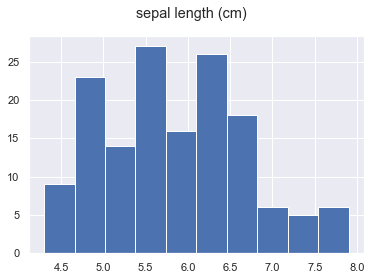
    


```python
col = "sepal width (cm)"
df[col].hist()
plt.suptitle(col)
plt.show()
```


    
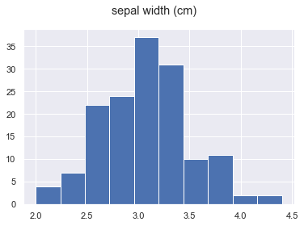
    


```python
col = "petal length (cm)"
df[col].hist()
plt.suptitle(col)
plt.show()
```


    
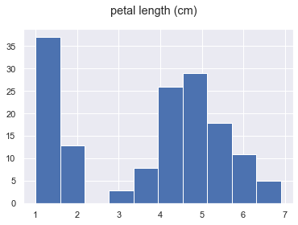
    


```python
col = "petal width (cm)"
df[col].hist()
plt.suptitle(col)
plt.show()
```


    
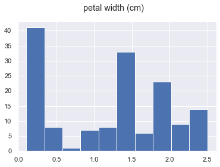
    


# Relationship of data features with the target


```python
data["target_names"]
```


    array(['setosa', 'versicolor', 'virginica'], dtype='<U10')


```python
#Create a new column with the species name
df["target_names"] = df["target"].map({0:"setosa", 1:"versicolor", 2:"virginica"})
```


```python
df.head()
```


<div>
<style scoped>
    .dataframe tbody tr th:only-of-type {
        vertical-align: middle;
    }

    .dataframe tbody tr th {
        vertical-align: top;
    }

    .dataframe thead th {
        text-align: right;
    }
</style>
<table border="1" class="dataframe">
  <thead>
    <tr style="text-align: right;">
      <th></th>
      <th>sepal length (cm)</th>
      <th>sepal width (cm)</th>
      <th>petal length (cm)</th>
      <th>petal width (cm)</th>
      <th>target</th>
      <th>target_names</th>
    </tr>
  </thead>
  <tbody>
    <tr>
      <th>0</th>
      <td>5.1</td>
      <td>3.5</td>
      <td>1.4</td>
      <td>0.2</td>
      <td>0</td>
      <td>setosa</td>
    </tr>
    <tr>
      <th>1</th>
      <td>4.9</td>
      <td>3.0</td>
      <td>1.4</td>
      <td>0.2</td>
      <td>0</td>
      <td>setosa</td>
    </tr>
    <tr>
      <th>2</th>
      <td>4.7</td>
      <td>3.2</td>
      <td>1.3</td>
      <td>0.2</td>
      <td>0</td>
      <td>setosa</td>
    </tr>
    <tr>
      <th>3</th>
      <td>4.6</td>
      <td>3.1</td>
      <td>1.5</td>
      <td>0.2</td>
      <td>0</td>
      <td>setosa</td>
    </tr>
    <tr>
      <th>4</th>
      <td>5.0</td>
      <td>3.6</td>
      <td>1.4</td>
      <td>0.2</td>
      <td>0</td>
      <td>setosa</td>
    </tr>
  </tbody>
</table>
</div>


```python
col = "sepal length (cm)"
sns.relplot(x = col, y = "target", hue = "target_names", data = df)
_ = plt.suptitle(col, y=1.05)
#plt.show()
```


    
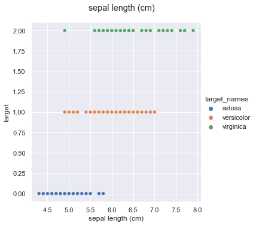
    


```python
col = "sepal width (cm)"
sns.relplot(x = col, y = "target", hue = "target_names", data = df)
_ = plt.suptitle(col, y=1.05)
#plt.show()
```


    
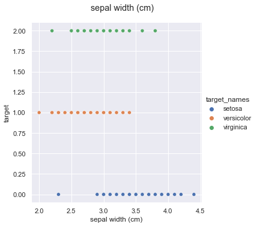
    


```python
col = "petal length (cm)"
sns.relplot(x = col, y = "target", hue = "target_names", data = df)
_ = plt.suptitle(col, y=1.05)
#plt.show()
```


    
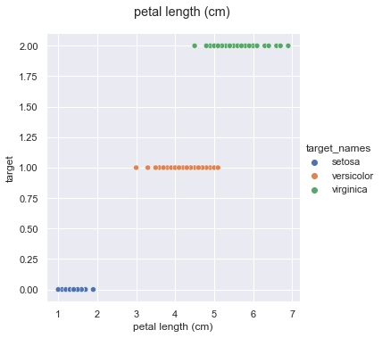
    


```python
col = "petal width (cm)"
sns.relplot(x = col, y = "target", hue = "target_names", data = df)
_ = plt.suptitle(col, y=1.05)
#plt.show()
```


    
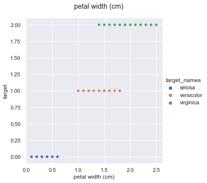
    


# Exploratory Data Analysis(EDA) - Pair plots


```python
sns.pairplot(df, hue = "target_names")
```


    <seaborn.axisgrid.PairGrid at 0x17afd444040>


    
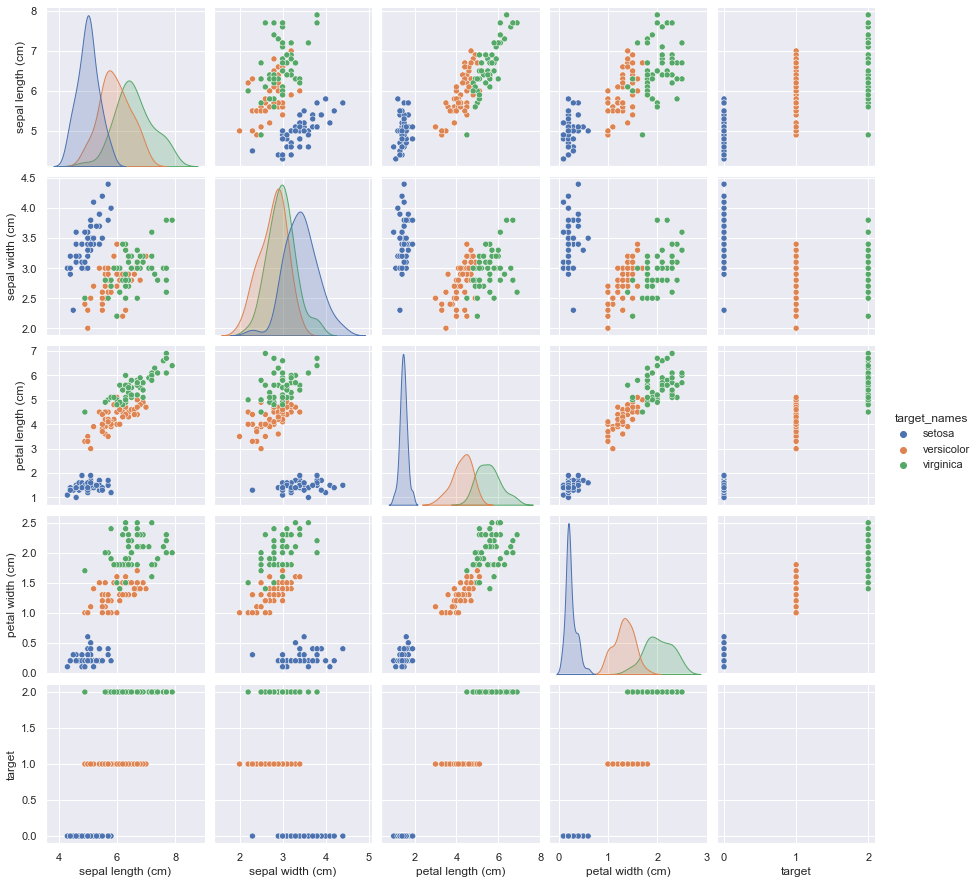
    


## Train Test split
you always want to evaluate your final model on a test set that hasn't been used at all in the training process. So we'll split off a test set here.
(Note: This might be a little less true if you use cross-validation, but is still considered a best practice


```python
from sklearn.model_selection import train_test_split
```


```python
df_train, df_test = train_test_split(df, test_size=0.25)
```


```python
df_train.shape
```


    (112, 6)


```python
df_test.shape
```


    (38, 6)


## Prepare our data for modeling
this involves splitting the data back out into plain NumPy arrays


```python
X_train = df_train.drop(columns=["target", "target_names"]).values
```


```python
y_train = df_train["target"].values
```


```python
X_test = df_test.drop(columns=["target", "target_names"]).values
y_test = df_test["target"].values
```


```python
type(y_train)
```


    numpy.ndarray


## Modeling - Simple manual model
Let's manually look at our data and decide some cutoff points for classification.


```python
def single_feature_prediction(petal_length):
    """Predicts the Iris species given the petal length."""
    if petal_length < 2.5:
        return 0
    elif petal_length < 4.8:
        return 1
    else:
        return 2
```


```python
X_train[:,2]
```


    array([3.8, 4.5, 4.2, 1.9, 1.6, 1.5, 4.9, 5.3, 1.3, 4.5, 4. , 1.3, 6.7,
           3.9, 5.6, 1.7, 6. , 6.1, 4.9, 6.3, 4.7, 3.3, 5.1, 4.1, 5. , 5.1,
           5.6, 1.5, 5.1, 4.7, 5.8, 1.6, 4.5, 1.5, 1.6, 5.9, 1. , 1.5, 5.3,
           3.5, 5.7, 4.7, 4.7, 6.1, 1.3, 4.2, 1.7, 1.4, 3.5, 1.5, 6.7, 4.2,
           1.4, 1.5, 4.5, 5. , 1.6, 1.4, 4.5, 1.4, 6.1, 1.9, 1.4, 1.6, 1.2,
           5.5, 1.5, 1.4, 1.4, 3.3, 1.3, 1.5, 5. , 4.3, 6. , 6.6, 4.4, 1.4,
           1.5, 4. , 4.9, 4.2, 5.4, 1.4, 4.5, 5.7, 5.1, 5.5, 4.5, 1.4, 5.2,
           1.4, 5.7, 3.9, 5.1, 1.4, 1.6, 5.1, 3.9, 5.9, 1.6, 4.1, 4.6, 3.7,
           1.5, 4.4, 4.8, 1.7, 1.1, 1.5, 5.6, 4.7])


```python
manual_y_predictions = np.array([single_feature_prediction(val) for val in X_train[:,2]])
```


```python
manual_model_accuracy = np.mean(manual_y_predictions==y_train)
```


```python
print(f"Manual Model Accuracy : {manual_model_accuracy*100:.2f}%")
```

    Manual Model Accuracy : 96.43%
    

## Modeling - Logistic Regression


```python
from sklearn.linear_model import LogisticRegression
```


```python
model = LogisticRegression()
```


```python
model.fit(X_train,y_train)
```

    C:\ProgramData\Anaconda3\lib\site-packages\sklearn\linear_model\_logistic.py:763: ConvergenceWarning: lbfgs failed to converge (status=1):
    STOP: TOTAL NO. of ITERATIONS REACHED LIMIT.
    
    Increase the number of iterations (max_iter) or scale the data as shown in:
        https://scikit-learn.org/stable/modules/preprocessing.html
    Please also refer to the documentation for alternative solver options:
        https://scikit-learn.org/stable/modules/linear_model.html#logistic-regression
      n_iter_i = _check_optimize_result(
    


    LogisticRegression()


```python
X_test.shape
```


    (38, 4)


```python
y_test.shape
```


    (38,)


```python
y_pred = model.predict(X_test)
```


```python
np.mean(y_pred == y_test)
```


    0.9736842105263158


```python
model.score(X_test,y_test)
```


    0.9736842105263158


## Using cross validation to evaluate our model


```python
from sklearn.model_selection import cross_val_score, cross_val_predict
```


```python
model = LogisticRegression(max_iter=200)
```


```python
accuracies = cross_val_score(model, X_train, y_train, cv=5, scoring = "accuracy")
```


```python
np.mean(accuracies)
```


    0.9553359683794467


## Where are we misclassifying points?


```python
y_pred = cross_val_predict(model, X_train, y_train, cv=5)
```


```python
# booloean mask
predicted_correctly_mask = y_pred == y_train
```


```python
not_predicted = ~predicted_correctly_mask
```


```python
X_train[not_predicted]
```


    array([[6.3, 2.8, 5.1, 1.5],
           [6. , 2.2, 5. , 1.5],
           [6.7, 3. , 5. , 1.7],
           [4.9, 2.5, 4.5, 1.7],
           [5.9, 3.2, 4.8, 1.8]])


```python
df_predictions = df_train.copy()
```


```python
df_predictions["correct_prediction"] = predicted_correctly_mask
```


```python
df_predictions["prediction"] = y_pred
```


```python
df_predictions["prediction_label"] = df_predictions["prediction"].map({0: "setosa", 1:"versicolor", 2:"virginica"})
```


```python
df_predictions
```


<div>
<style scoped>
    .dataframe tbody tr th:only-of-type {
        vertical-align: middle;
    }

    .dataframe tbody tr th {
        vertical-align: top;
    }

    .dataframe thead th {
        text-align: right;
    }
</style>
<table border="1" class="dataframe">
  <thead>
    <tr style="text-align: right;">
      <th></th>
      <th>sepal length (cm)</th>
      <th>sepal width (cm)</th>
      <th>petal length (cm)</th>
      <th>petal width (cm)</th>
      <th>target</th>
      <th>target_names</th>
      <th>correct_prediction</th>
      <th>prediction</th>
      <th>prediction_label</th>
    </tr>
  </thead>
  <tbody>
    <tr>
      <th>80</th>
      <td>5.5</td>
      <td>2.4</td>
      <td>3.8</td>
      <td>1.1</td>
      <td>1</td>
      <td>versicolor</td>
      <td>True</td>
      <td>1</td>
      <td>versicolor</td>
    </tr>
    <tr>
      <th>68</th>
      <td>6.2</td>
      <td>2.2</td>
      <td>4.5</td>
      <td>1.5</td>
      <td>1</td>
      <td>versicolor</td>
      <td>True</td>
      <td>1</td>
      <td>versicolor</td>
    </tr>
    <tr>
      <th>61</th>
      <td>5.9</td>
      <td>3.0</td>
      <td>4.2</td>
      <td>1.5</td>
      <td>1</td>
      <td>versicolor</td>
      <td>True</td>
      <td>1</td>
      <td>versicolor</td>
    </tr>
    <tr>
      <th>24</th>
      <td>4.8</td>
      <td>3.4</td>
      <td>1.9</td>
      <td>0.2</td>
      <td>0</td>
      <td>setosa</td>
      <td>True</td>
      <td>0</td>
      <td>setosa</td>
    </tr>
    <tr>
      <th>11</th>
      <td>4.8</td>
      <td>3.4</td>
      <td>1.6</td>
      <td>0.2</td>
      <td>0</td>
      <td>setosa</td>
      <td>True</td>
      <td>0</td>
      <td>setosa</td>
    </tr>
    <tr>
      <th>...</th>
      <td>...</td>
      <td>...</td>
      <td>...</td>
      <td>...</td>
      <td>...</td>
      <td>...</td>
      <td>...</td>
      <td>...</td>
      <td>...</td>
    </tr>
    <tr>
      <th>18</th>
      <td>5.7</td>
      <td>3.8</td>
      <td>1.7</td>
      <td>0.3</td>
      <td>0</td>
      <td>setosa</td>
      <td>True</td>
      <td>0</td>
      <td>setosa</td>
    </tr>
    <tr>
      <th>13</th>
      <td>4.3</td>
      <td>3.0</td>
      <td>1.1</td>
      <td>0.1</td>
      <td>0</td>
      <td>setosa</td>
      <td>True</td>
      <td>0</td>
      <td>setosa</td>
    </tr>
    <tr>
      <th>34</th>
      <td>4.9</td>
      <td>3.1</td>
      <td>1.5</td>
      <td>0.2</td>
      <td>0</td>
      <td>setosa</td>
      <td>True</td>
      <td>0</td>
      <td>setosa</td>
    </tr>
    <tr>
      <th>103</th>
      <td>6.3</td>
      <td>2.9</td>
      <td>5.6</td>
      <td>1.8</td>
      <td>2</td>
      <td>virginica</td>
      <td>True</td>
      <td>2</td>
      <td>virginica</td>
    </tr>
    <tr>
      <th>73</th>
      <td>6.1</td>
      <td>2.8</td>
      <td>4.7</td>
      <td>1.2</td>
      <td>1</td>
      <td>versicolor</td>
      <td>True</td>
      <td>1</td>
      <td>versicolor</td>
    </tr>
  </tbody>
</table>
<p>112 rows × 9 columns</p>
</div>


```python
sns.scatterplot(x="petal length (cm)" , y="petal width (cm)", hue="prediction_label",data = df_predictions)
```


    <AxesSubplot:xlabel='petal length (cm)', ylabel='petal width (cm)'>


    
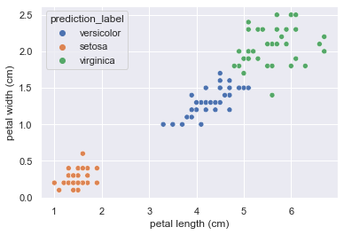
    


```python
sns.scatterplot(x="petal length (cm)" , y="petal width (cm)", hue="target_names",data = df_predictions)
```


    <AxesSubplot:xlabel='petal length (cm)', ylabel='petal width (cm)'>


    

    


```python
def plot_incorrect_preditctions(df_predictions, x_axis_feature, y_axis_feature):
    fig, axs = plt.subplots(2, 2, figsize = (10, 10))
    axs = axs.flatten()
    sns.scatterplot(x=x_axis_feature, y=y_axis_feature, hue="prediction_label", data=df_predictions, ax=axs[0])
    sns.scatterplot(x=x_axis_feature, y=y_axis_feature, hue="target_names", data=df_predictions, ax=axs[1])
    sns.scatterplot(x=x_axis_feature, y=y_axis_feature, hue="correct_prediction", data=df_predictions, ax=axs[2])
    axs[3].set_visible(False)
    plt.show()
```


```python
plot_incorrect_preditctions(df_predictions, "petal length (cm)", "petal width (cm)")
```


    
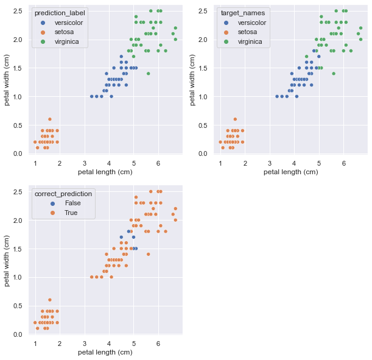
    


```python
fig, axs = plt.subplots(2, 2, figsize = (10, 10))
axs = axs.flatten()
sns.scatterplot(x="petal length (cm)" , y="petal width (cm)", hue="target_names",data = df_predictions, ax=axs[1])
```


    <AxesSubplot:xlabel='petal length (cm)', ylabel='petal width (cm)'>


    
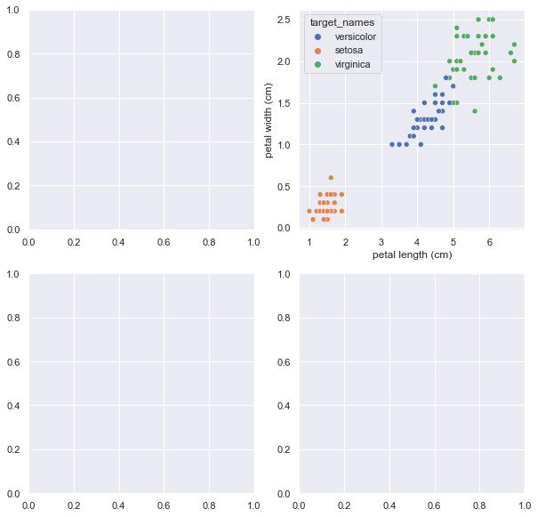
    


## Model Tuning
What is model Tuning?
Model tuning is trying to determine the parameters of your model(these are also known as "hyperparameters") that maximizes the model performance.


```python
model = LogisticRegression(max_iter=200, C=3)
accuracies = cross_val_score(model, X_train, y_train, cv = 5, scoring = "accuracy")
print(f"Accuracy:{np.mean(accuracies)*100:.2f}%")
```

    Accuracy:97.31%
    

# Final Model


```python
model = LogisticRegression(max_iter=200, C=3)
```


```python
X_test.shape
```


    (38, 4)


```python
y_test
```


    array([0, 0, 2, 1, 1, 2, 2, 1, 1, 0, 1, 2, 1, 0, 2, 1, 1, 0, 2, 1, 2, 2,
           1, 1, 1, 0, 1, 2, 0, 2, 2, 1, 2, 2, 0, 1, 2, 2])


```python
model.fit(X_train, y_train)
```


    LogisticRegression(C=3, max_iter=200)


```python
y_test_pred = model.predict(X_test)
```


```python
test_set_correctly_classified = y_test_pred == y_test
test_set_accuracy = np.mean(test_set_correctly_classified)
```


```python
print(f"Test set accuracy : {test_set_accuracy*100:.2f}")
```

    Test set accuracy : 97.37
    


```python
test_set_correctly_classified
```


    array([ True,  True,  True,  True,  True,  True,  True,  True,  True,
            True,  True,  True,  True,  True,  True,  True,  True,  True,
            True,  True,  True,  True, False,  True,  True,  True,  True,
            True,  True,  True,  True,  True,  True,  True,  True,  True,
            True,  True])


```python
df_predictions_test = df_test.copy()
df_predictions_test["correct_prediction"] = test_set_correctly_classified
df_predictions_test["predictions"] = y_test_pred
df_predictions_test["prediction_label"] = df_predictions_test["predictions"].map({0:"setosa", 1:"versicolor", 2:"virginica"})
```


```python
df_predictions_test.head()
```


<div>
<style scoped>
    .dataframe tbody tr th:only-of-type {
        vertical-align: middle;
    }

    .dataframe tbody tr th {
        vertical-align: top;
    }

    .dataframe thead th {
        text-align: right;
    }
</style>
<table border="1" class="dataframe">
  <thead>
    <tr style="text-align: right;">
      <th></th>
      <th>sepal length (cm)</th>
      <th>sepal width (cm)</th>
      <th>petal length (cm)</th>
      <th>petal width (cm)</th>
      <th>target</th>
      <th>target_names</th>
      <th>correct_prediction</th>
      <th>predictions</th>
      <th>prediction_label</th>
    </tr>
  </thead>
  <tbody>
    <tr>
      <th>36</th>
      <td>5.5</td>
      <td>3.5</td>
      <td>1.3</td>
      <td>0.2</td>
      <td>0</td>
      <td>setosa</td>
      <td>True</td>
      <td>0</td>
      <td>setosa</td>
    </tr>
    <tr>
      <th>41</th>
      <td>4.5</td>
      <td>2.3</td>
      <td>1.3</td>
      <td>0.3</td>
      <td>0</td>
      <td>setosa</td>
      <td>True</td>
      <td>0</td>
      <td>setosa</td>
    </tr>
    <tr>
      <th>129</th>
      <td>7.2</td>
      <td>3.0</td>
      <td>5.8</td>
      <td>1.6</td>
      <td>2</td>
      <td>virginica</td>
      <td>True</td>
      <td>2</td>
      <td>virginica</td>
    </tr>
    <tr>
      <th>76</th>
      <td>6.8</td>
      <td>2.8</td>
      <td>4.8</td>
      <td>1.4</td>
      <td>1</td>
      <td>versicolor</td>
      <td>True</td>
      <td>1</td>
      <td>versicolor</td>
    </tr>
    <tr>
      <th>99</th>
      <td>5.7</td>
      <td>2.8</td>
      <td>4.1</td>
      <td>1.3</td>
      <td>1</td>
      <td>versicolor</td>
      <td>True</td>
      <td>1</td>
      <td>versicolor</td>
    </tr>
  </tbody>
</table>
</div>


```python
plot_incorrect_preditctions(df_predictions_test, x_axis_feature="petal length (cm)", y_axis_feature= "petal width (cm)")
```


    
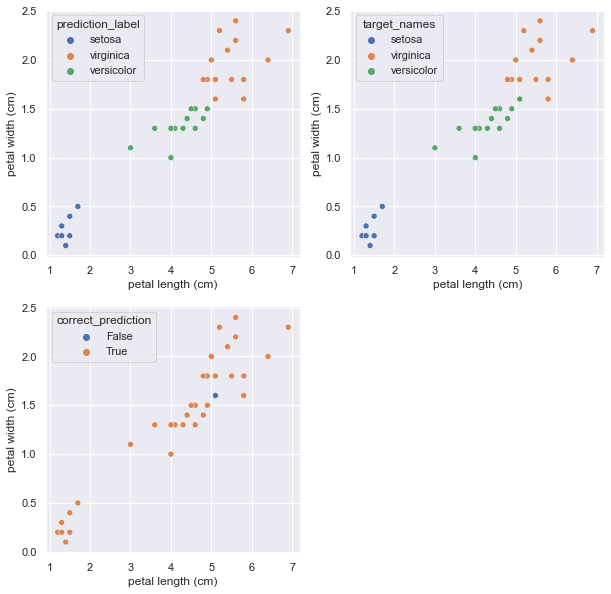
    


```python

```
